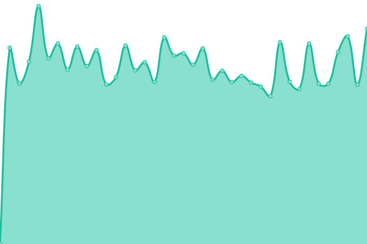
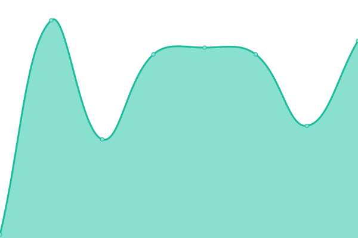

# [📈 Live Status](https://dyanakiev.github.io/test-monitoring): <!--live status--> **🟧 Partial outage**

This repository contains the open-source uptime monitor and status page for [Dimitar Yanakiev](https://dyanakiev.github.io/test-monitoring), powered by [Upptime](https://github.com/upptime/upptime).

With [Upptime](https://upptime.js.org), you can get your own unlimited and free uptime monitor and status page, powered entirely by a GitHub repository. We use [Issues](https://github.com/dyanakiev/test-monitoring/issues) as incident reports, [Actions](https://github.com/dyanakiev/test-monitoring/actions) as uptime monitors, and [Pages](https://dyanakiev.github.io/test-monitoring) for the status page.

<!--start: status pages-->
<!-- This summary is generated by Upptime (https://github.com/upptime/upptime) -->
<!-- Do not edit this manually, your changes will be overwritten -->
<!-- prettier-ignore -->
| URL | Status | History | Response Time | Uptime |
| --- | ------ | ------- | ------------- | ------ |
|  Secret Site 1 | 🟩 Up | [secret-site-1.yml](https://github.com/dyanakiev/test-monitoring/commits/HEAD/history/secret-site-1.yml) | 

 871ms
     
 | 

<a href="https://dyanakiev.github.io/test-monitoring/history/secret-site-1">100.00%</a>
    

|  Secret Site 2 | 🟩 Up | [secret-site-2.yml](https://github.com/dyanakiev/test-monitoring/commits/HEAD/history/secret-site-2.yml) | 

 1029ms
     
 | 

<a href="https://dyanakiev.github.io/test-monitoring/history/secret-site-2">100.00%</a>
    

|  Secret Site 3 | 🟥 Down | [secret-site-3.yml](https://github.com/dyanakiev/test-monitoring/commits/HEAD/history/secret-site-3.yml) | 

 226ms
     
 | 

<a href="https://dyanakiev.github.io/test-monitoring/history/secret-site-3">100.00%</a>
    

|  [TCP ping](1.1.1.1) | 🟩 Up | [tcp-ping.yml](https://github.com/dyanakiev/test-monitoring/commits/HEAD/history/tcp-ping.yml) | 

 62ms
     
 | 

<a href="https://dyanakiev.github.io/test-monitoring/history/tcp-ping">100.00%</a>
    

<!--end: status pages-->

[**Visit our status website →**](https://dyanakiev.github.io/test-monitoring)

## 📄 License

- Powered by: [Upptime](https://github.com/upptime/upptime)
- Code: [MIT](./LICENSE) © [Dimitar Yanakiev](https://dyanakiev.github.io/test-monitoring)
- Data in the `./history` directory: [Open Database License](https://opendatacommons.org/licenses/odbl/1-0/)
